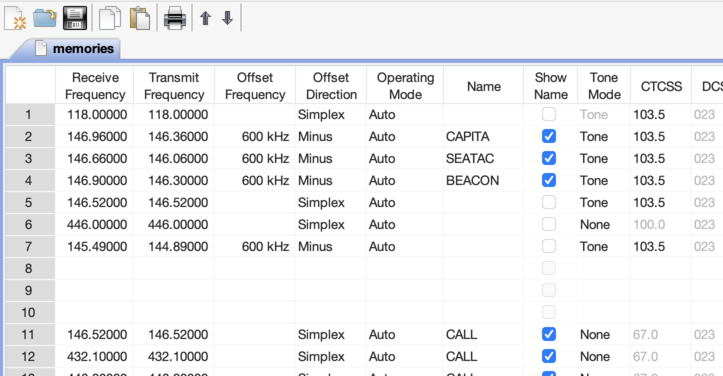
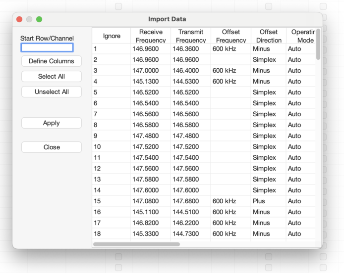
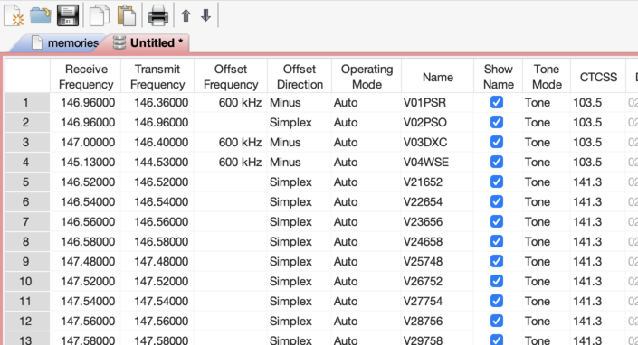
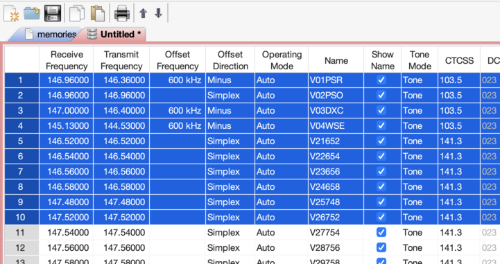
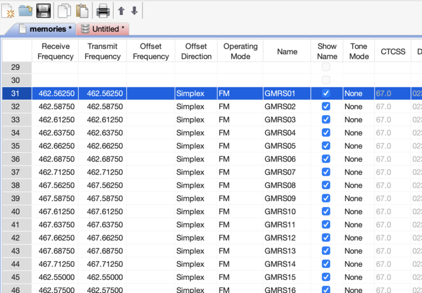
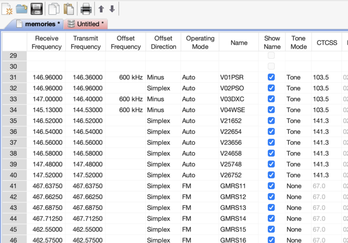

# The files in this subdirectory

* 2m.csv — 2m band
* 220.csv — 1.25m band
* 70cm.csv — 70cm band
* 6m.csv — 6m band
* data.csv — data channels
* hub.csv — frequencies used by Seattle Emergency Hubs
* narrow.csv — upcoming narrow band frequencies
* noaa.csv — NOAA weather frequencies
* winlink.csv — Winlink frequencies
* murs.csv — Multi-Use Radio Service

# Loading and installing a CSV file for RT Systems software

Short video: https://www.youtube.com/watch?v=n52Fra0JfIA

These instructions were written for FT-60 Programmer and have been
tested with FTM-7250 as well, with few or no changes should work
across the board for RT Systems software.  If you run into issues
feel free to contact me, KK7NNS au gmail.com

## Launch RT Systems software

## Download the current radio data

Either download from the radio (**Communications > Get Data From Radio**)

Or load a previously-saved image file (**File > Open…**, select image file)

## Load the CSV data into a new tab

**File > New**

**File > Import …**, select e.g. `RT/2m.csv`)

This import dialog looks complicated, but all you need to do is
choose **Select all** and then **Apply** and then dismiss the dialog.

## Copy the programming data

The CSV file starts with entry #1 because we don't know how you
intend to allocate memories in your own radio, so #1 is as good a
starting point as any. In addition, your radio may not have enough
memories to hold the entire ACS database , so you'll have to pick
and choose which entries you copy.

So what you do now is select a block of entries from the CSV file and hit **Copy**.
*Note: select multiple entries in the leftmost column.*

## Paste the data

Now switch to the tab that contains your radio data, and select the first row where you want to
paste the data.

And hit **Paste**

## Repeat as needed

If you don't copy the entire database in one swell foop, then go back and copy/paste the next
bunch of records and so forth.

## Write data back to the radio

Write the data back to the radio (**Communications > Send Data To Radio**)

Optionally save your image file.

You can close tabs or simply exit RT Systems at this point.
