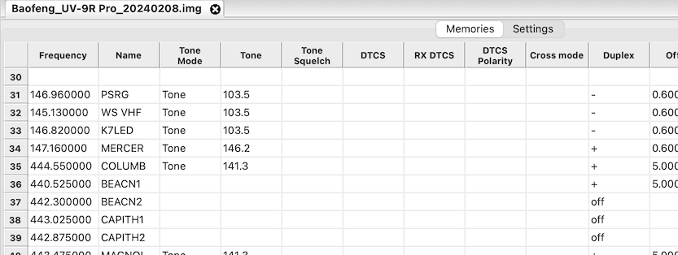
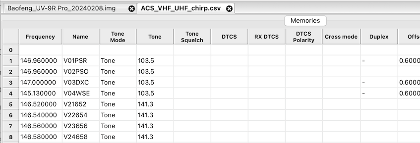
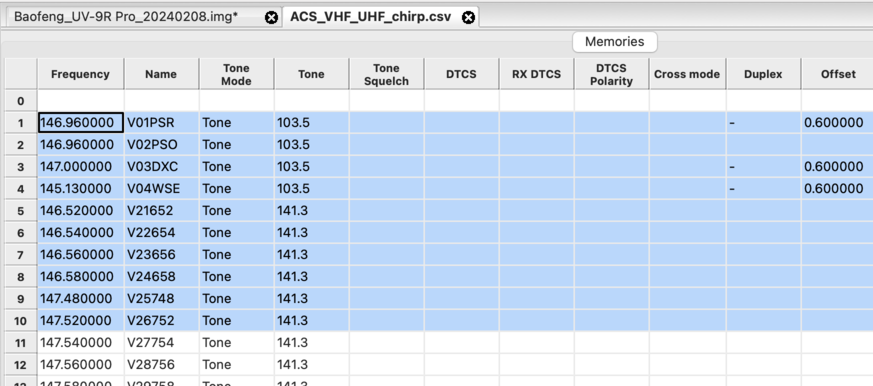
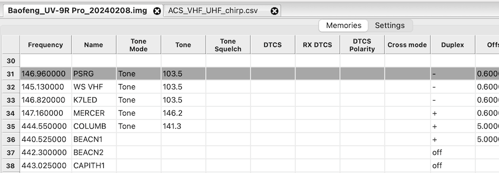

# The files in this subdirectory

* 2m.csv — 2m band
* 220.csv — 1.25m band
* 70cm.csv — 70cm band
* 6m.csv — 6m band
* data.csv — data channels
* hub.csv — frequencies used by Seattle Emergency Hubs
* hub\_GMRS.csv — same, for programming GMRS radios
* narrow.csv — upcoming narrow band frequencies
* noaa.csv — NOAA weather frequencies
* winlink.csv — Winlink frequencies

# Loading and installing a CSV file for CHIRP

A short video: https://www.youtube.com/watch?v=ehvOrtVYogs

## Launch CHIRP

## Download the current radio data

Either download from the radio (**Radio > Download from radio …**)

Or load a previously-saved image file (**File > Open…**, select `.img` file)

## Load the CSV data into another tab

**File > Open …**, select e.g. `Chirp/2m.csv`)

## Copy the programming data

The CSV file starts with entry #1 because we don't know how you intend to allocate memories in
your own radio, so #1 is as good a starting point as any. In addition, your radio may not have
enough memories to hold the entire ACS database (e.g. most Baofeng radios), so you'll have to
pick and choose which entries you copy.

So what you do now is select a block of entries from the CSV file and hit **Copy**.

## Paste the data

Now switch to the tab that contains your radio data, and select the first row where you want to
paste the data.

And hit **Paste**

## Repeat as needed

If you don't copy the entire database in one swell foop, then go back and copy/paste the next
bunch of records and so forth.

## Write data back to the radio

Write the data back to the radio (**Radio > Upload to radio…**)

Optionally save your `.img` file.

You can close tabs or simply exit CHIRP at this point.
